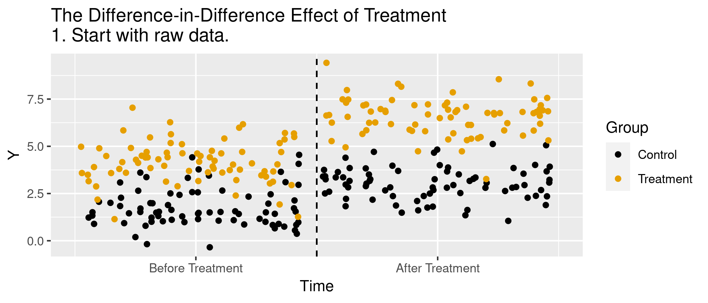

<!-- Adjust some CSS code for font size and maintain R code font size -->
<style type="text/css">
.remark-slide-content {
    font-size: 30px;
    padding: 1em 2em 1em 2em;    
}
.remark-code {
  font-size: 15px;
}
.remark-inline-code { 
    font-size: 20px;
}
</style>


<!-- Set R options for how code chunks are displayed and load packages -->
```{r setup, include=FALSE}
options(htmltools.dir.version = FALSE)
library(knitr)
knitr::opts_chunk$set(
  fig.align="center",  
  fig.height=3, #fig.width=6,
  # out.width="748px", #out.length="520.75px",
  dpi=300, #fig.path='Figs/',
  cache=T,# echo=F, warning=F, message=F
  warning = FALSE, 
  message = FALSE, 
  cache.lazy = FALSE,
  error=TRUE
  )

knitr::opts_hooks$set(fig.callout = function(options) {
  if(options$fig.callout) {
    options$echo = FALSE
  }
  options
})

if (!require("pacman")) install.packages("pacman")
pacman::p_load(tidyverse, ggplot2, dplyr, lubridate, readr, readxl, hrbrthemes,
               scales, plotly, gganimate, cobalt, stargazer, haven, ggthemes,
               gifski, magick, lfe, dotwhisker, here, modelsummary)
set.seed(1234)
```

# Table of contents

1. [Intuition](#intuition)
2. [Estimation](#estimation)
3. [In Practice](#handson)

---
class: inverse, center, middle
name: intuition

# The Idea of DD

<html><div style='float:left'></div><hr color='#EB811B' size=1px width=1055px></html>

---
# Setup
Want to estimate $E[Y_{1}(1)- Y_{0}(1) | W=1]$

![:col_header , Post-period, Pre-period]
![:col_row Treated, \(E(Y_{1}(1)|W=1)\), \(E(Y_{0}(0)|W=1)\)]
![:col_row Control, \(E(Y_{0}(1)|W=0)\), \(E(Y_{0}(0)|W=0)\)]

<br>
Problem: We don't see $E[Y_{0}(1)|W=1]$


---
count: false

# Setup
Want to estimate $E[Y_{1}(1)- Y_{0}(1) | W=1]$

![:col_header , Post-period, Pre-period]
![:col_row Treated, \(E(Y_{1}(1)|W=1)\), \(E(Y_{0}(0)|W=1)\)]
![:col_row Control, \(E(Y_{0}(1)|W=0)\), \(E(Y_{0}(0)|W=0)\)]

<br>
Strategy 1: Estimate $E[Y_{0}(1)|W=1]$ using $E[Y_{0}(0)|W=1]$ (before treatment outcome used to estimate post-treatment)


---
count: false

# Setup
Want to estimate $E[Y_{1}(1)- Y_{0}(1) | W=1]$

![:col_header , Post-period, Pre-period]
![:col_row Treated, \(E(Y_{1}(1)|W=1)\), \(E(Y_{0}(0)|W=1)\)]
![:col_row Control, \(E(Y_{0}(1)|W=0)\), \(E(Y_{0}(0)|W=0)\)]

<br>
Strategy 2: Estimate $E[Y_{0}(1)|W=1]$ using $E[Y_{0}(1)|W=0]$ (control group used to predict outcome for treatment)


---
count: false

# Setup
Want to estimate $E[Y_{1}(1)- Y_{0}(1) | W=1]$

![:col_header , Post-period, Pre-period]
![:col_row Treated, \(E(Y_{1}(1)|W=1)\), \(E(Y_{0}(0)|W=1)\)]
![:col_row Control, \(E(Y_{0}(1)|W=0)\), \(E(Y_{0}(0)|W=0)\)]

<br>
Strategy 3: DD estimate...

Estimate $E[Y_{1}(1)|W=1] - E[Y_{0}(1)|W=1]$ using $E[Y_{0}(1)|W=0] - E[Y_{0}(0)|W=0]$ (pre-post difference in control group used to predict difference for treatment group)

---
# Animations!
```{r animate, message=FALSE, warning=FALSE, include=FALSE}
df <- data.frame(Control = c(rep("Control",150),rep("Treatment",150)),
                 Time=rep(c(rep("Before",75),rep("After",75)),2)) %>%
  mutate(Y = 2+2*(Control=="Treatment")+1*(Time=="After") + 1.5*(Control=="Treatment")*(Time=="After")+rnorm(300),state="1",
         xaxisTime = (Time == "Before") + 2*(Time == "After") + (runif(300)-.5)*.95) %>%
  group_by(Control,Time) %>%
  mutate(mean_Y=mean(Y)) %>%
  ungroup()

df$Time <- factor(df$Time,levels=c("Before","After"))

#Create segments
dfseg <- df %>%
  group_by(Control,Time) %>%
  summarize(mean_Y = mean(mean_Y)) %>%
  ungroup()

diff <- filter(dfseg,Time=='After',Control=='Control')$mean_Y[1] - filter(dfseg,Time=='Before',Control=='Control')$mean_Y[1]

dffull <- rbind(
  #Step 1: Raw data only
  df %>% mutate(state='1. Start with raw data.'),
  #Step 2: Add Y-lines
  df %>% mutate(state='2. Figure out what differences in Y are explained by Treatment and/or Time.'),
  #Step 3: Collapse to means
  df %>% mutate(Y = mean_Y,state="3. Keep only what's explained by Treatment and/or Time."),
  #Step 4: Display time effect
  df %>% mutate(Y = mean_Y,state="4. See how Control changed over Time."),
  #Step 5: Shift to remove time effect
  df %>% mutate(Y = mean_Y 
                - (Time=='After')*diff,
                state="5. Remove the Before/After Control difference for both groups."),
  #Step 6: Raw demeaned data only
  df %>% mutate(Y = mean_Y 
                - (Time=='After')*diff,
                state='6. The remaining Before/After Treatment difference is the effect.'))


p <- ggplot(dffull,aes(y=Y,x=xaxisTime,color=as.factor(Control)))+geom_point()+
  guides(color=guide_legend(title="Group"))+
  geom_vline(aes(xintercept=1.5),linetype='dashed')+
  scale_color_colorblind()+
  scale_x_continuous(
    breaks = c(1, 2),
    label = c("Before Treatment", "After Treatment")
  )+xlab("Time")+
  #The four lines for the four means
  geom_segment(aes(x=ifelse(state %in% c('2. Figure out what differences in Y are explained by Treatment and/or Time.',"3. Keep only what's explained by Treatment and/or Time."),
                            .5,NA),
                   xend=1.5,y=filter(dfseg,Time=='Before',Control=='Control')$mean_Y[1],
                   yend=filter(dfseg,Time=='Before',Control=='Control')$mean_Y[1]),size=1,color='black')+
  geom_segment(aes(x=ifelse(state %in% c('2. Figure out what differences in Y are explained by Treatment and/or Time.',"3. Keep only what's explained by Treatment and/or Time."),
                            .5,NA),
                   xend=1.5,y=filter(dfseg,Time=='Before',Control=='Treatment')$mean_Y[1],
                   yend=filter(dfseg,Time=='Before',Control=='Treatment')$mean_Y[1]),size=1,color="#E69F00")+
  geom_segment(aes(x=ifelse(state %in% c('2. Figure out what differences in Y are explained by Treatment and/or Time.',"3. Keep only what's explained by Treatment and/or Time."),
                            1.5,NA),
                   xend=2.5,y=filter(dfseg,Time=='After',Control=='Control')$mean_Y[1],
                   yend=filter(dfseg,Time=='After',Control=='Control')$mean_Y[1]),size=1,color='black')+
  geom_segment(aes(x=ifelse(state %in% c('2. Figure out what differences in Y are explained by Treatment and/or Time.',"3. Keep only what's explained by Treatment and/or Time."),
                            1.5,NA),
                   xend=2.5,y=filter(dfseg,Time=='After',Control=='Treatment')$mean_Y[1],
                   yend=filter(dfseg,Time=='After',Control=='Treatment')$mean_Y[1]),size=1,color="#E69F00")+
  #Line indicating treatment effect
  geom_segment(aes(x=1.5,xend=1.5,
                   y=ifelse(state=='6. The remaining Before/After Treatment difference is the effect.',
                            filter(dfseg,Time=='After',Control=='Treatment')$mean_Y[1]-diff,NA),
                   yend=filter(dfseg,Time=='Before',Control=='Treatment')$mean_Y[1]),size=1.5,color='blue')+
  #Line indicating pre/post control difference
  geom_segment(aes(x=1.5,xend=1.5,
                   y=ifelse(state=="4. See how Control changed over Time.",
                            filter(dfseg,Time=='After',Control=='Control')$mean_Y[1],
                            ifelse(state=="5. Remove the Before/After Control difference for both groups.",
                                   filter(dfseg,Time=='Before',Control=='Control')$mean_Y[1],NA)),
                   yend=filter(dfseg,Time=='Before',Control=='Control')$mean_Y[1]),size=1.5,color='blue')+
  labs(title = 'The Difference-in-Difference Effect of Treatment \n{next_state}')+
  transition_states(state,transition_length=c(6,16,6,16,6,6),state_length=c(50,22,12,22,12,50),wrap=FALSE)+
  ease_aes('sine-in-out')+
  exit_fade()+enter_fade()

anim.p <- animate(p,nframes=150)
anim_save("dd_animate.gif",
          anim.p,path=here("panel-data/slides"))
```

.center[
  
]


---
class: inverse, center, middle
name: estimation

# Average Treatment Effects with DD

<html><div style='float:left'></div><hr color='#EB811B' size=1px width=1055px></html>


---
# Estimation
Key identifying assumption is that of *parallel trends*


--
$$E[Y_{0}(1) - Y_{0}(0)|W=1] = E[Y_{0}(1) - Y_{0}(0)|W=0]$$

---
# Estimation
Sample means:<br>
$$\begin{align}
E[Y_{1}(1) - Y_{0}(1)|W=1] &=& \left( E[Y(1)|W=1] - E[Y(1)|W=0] \right) \\
 & & - \left( E[Y(0)|W=1] - E[Y(0)|W=0]\right)
\end{align}$$


---
# Estimation
Regression:<br>
$Y_{i} = \alpha + \beta D_{i} + \lambda 1(Post) + \delta D_{i} \times 1(Post) + \varepsilon$

<br>
![:col_header , After, Before, After - Before]
![:col_row Treated, \(\alpha + \beta + \lambda + \delta\), \(\alpha + \beta\), \(\lambda + \delta\)]
![:col_row Control, \(\alpha + \lambda\), \(\alpha\), \(\lambda\)]
![:col_row Treated - Control, \(\beta + \delta\), \(\beta\), \(\delta\)]


---
# Simulated data
```{r}
N <- 5000
dd.dat <- tibble(
  w = (runif(N, 0, 1)>0.5),
  time_pre = "pre",
  time_post = "post"
)

dd.dat <- pivot_longer(dd.dat, c("time_pre","time_post"), values_to="time") %>%
  select(w, time) %>%
  mutate(t=(time=="post"),
         y.out=1.5+3*w + 1.5*t + 6*w*t + rnorm(N*2,0,1))
```

---
# Mean differences
```{r}
dd.means <- dd.dat %>% group_by(w, t) %>% summarize(mean_y = mean(y.out))
knitr::kable(dd.means, col.names=c("Treated","Post","Mean"), format="html")
```

---
# Mean differences
In this example:
- $E[Y(1)|W=1] - E[Y(1)|W=0]$ is `r dd.means[4,3]-dd.means[2,3]`
- $E[Y(0)|W=1] - E[Y(0)|W=0]$ is `r dd.means[3,3]-dd.means[1,3]`

<br>
<br>
So the ATT is `r dd.means[4,3]-dd.means[2,3] - (dd.means[3,3]-dd.means[1,3])`


---
# Regression estimator
```{r}
dd.est <- lm(y.out ~ w + t + w*t, data=dd.dat)
summary(dd.est)
```


---
class: inverse, center, middle
name: handson

# Seeing things in action

<html><div style='float:left'></div><hr color='#EB811B' size=1px width=1055px></html>


---
# Application
- Try out some real data on Medicaid expansion following the ACA
- Data available on GitHub (see code files for links)


--
Question: Did Medicaid expansion reduce uninsurance?

---
# Step 1: Look at the data

.pull-left[
**Stata**<br>
```{stata, eval=FALSE}
insheet using "https://raw.githubusercontent.com/imccart/empirical-methods/main/data/medicaid-expansion/mcaid-expand-data.txt", clear
gen perc_unins=uninsured/adult_pop
keep if expand_year=="2014" | expand_year=="NA"
drop if expand_ever=="NA"
collapse (mean) perc_unins, by(year expand_ever)
graph twoway (connected perc_unins year if expand_ever=="FALSE", color(black) lpattern(solid)) ///
  (connected perc_unins year if expand_ever=="TRUE", color(black) lpattern(dash)), ///
  xline(2013.5) ///
	ytitle("Fraction Uninsured") xtitle("Year") legend(off) text(0.15 2017 "Non-expansion", place(e)) text(0.08 2017 "Expansion", place(e))
```
]

.pull-right[
**R**<br>
```{r, eval=FALSE}
library(tidyverse)  
mcaid.data <- read_tsv("https://raw.githubusercontent.com/imccart/empirical-methods/main/data/medicaid-expansion/mcaid-expand-data.txt")
ins.plot.dat <- mcaid.data %>% filter(expand_year==2014 | is.na(expand_year), !is.na(expand_ever)) %>%
  mutate(perc_unins=uninsured/adult_pop) %>%
  group_by(expand_ever, year) %>% summarize(mean=mean(perc_unins))

ins.plot <- ggplot(data=ins.plot.dat, aes(x=year,y=mean,group=expand_ever,linetype=expand_ever)) + 
  geom_line() + geom_point() + theme_bw() +
  geom_vline(xintercept=2013.5, color="red") +
  geom_text(data = ins.plot.dat %>% filter(year == 2016), 
            aes(label = c("Non-expansion","Expansion"),
                x = year + 1,
                y = mean)) +
  guides(linetype=FALSE) +
  labs(
    x="Year",
    y="Fraction Uninsured",
    title="Share of Uninsured over Time"
  )
```
]


---
# Step 2: Estimate Effects
Interested in $\delta$ from:
$$y_{it} = \alpha + \beta \times 1(Post) + \lambda \times 1(Expand) + \delta \times 1(Post) \times 1(Expand) + \varepsilon$$

.pull-left[
**Stata**<br>
```{stata, eval=FALSE}
insheet using "https://raw.githubusercontent.com/imccart/empirical-methods/main/data/medicaid-expansion/mcaid-expand-data.txt", clear
gen perc_unins=uninsured/adult_pop
keep if expand_year=="2014" | expand_year=="NA"
drop if expand_ever=="NA"
gen post=(year>=2014)
gen treat=(expand_ever=="TRUE")
gen treat_post=(expand=="TRUE")

reg perc_unins treat post treat_post

**also try didregress
```
]

.pull-right[
**R**<br>
```{r, eval=FALSE}
library(tidyverse)
library(modelsummary)
mcaid.data <- read_tsv("https://raw.githubusercontent.com/imccart/empirical-methods/main/data/medicaid-expansion/mcaid-expand-data.txt")
reg.dat <- mcaid.data %>% filter(expand_year==2014 | is.na(expand_year), !is.na(expand_ever)) %>%
  mutate(perc_unins=uninsured/adult_pop,
         post = (year>=2014), 
         treat=post*expand_ever)

dd.ins.reg <- lm(perc_unins ~ post + expand_ever + post*expand_ever, data=reg.dat)
msummary(dd.ins.reg)
```
]

---
# Final thoughts

- Key identification assumption is **parallel trends**
- We've ignored any issues with inference
- Typically want to cluster at unit-level to allow for correlation over time within units
- "Extra" things like propensity score weighting and doubly robust estimation
